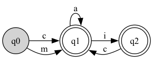

# DFA Simulator - README

# TODO: need to install pydot linux:

sudo apt install python3-pydot graphviz
mac:
https://formulae.brew.sh/formula/graphviz

## Overview

This project is an implementation of a Deterministic Finite Automaton (DFA) simulator in Python. It provides various functionalities such as importing DFA definitions from JSON files, validating the DFA, visualizing it, simulating words, generating word permutations, and determining the final state after processing an input word.

The DFA definition is loaded from a JSON file which includes information such as states, alphabet, transitions, starting state, accepting states, and words to test. Using this information, the class can visualize the DFA graphically and simulate inputs to check if they are accepted by the DFA.

## Features

- **DFA Definition via JSON**: Define DFAs using JSON files which include all necessary information (states, alphabet, transitions, etc.).
- **Validation**: Validate the DFA structure for consistency.
- **Simulation**: Simulate test words through the DFA to determine acceptance.
- **Visualization**: Graphically represent the DFA using NetworkX and Pydot.
- **Word Generation**: Generate all accepted words up to a specified length.
- **Exporting Permutations**: Write the generated words to a file.
- **State Tracking**: Find out the last state after simulating a specific word.

## JSON Structure for DFA Definition

The DFA can be defined using a JSON file.

```json
{
  "name": "test",
  "states": ["q0", "q1", "q2"],
  "alphabet": ["c", "i", "a", "m"],
  "transitions": [
    { "from": "q0", "symbol": "c", "to": "q1" },
    { "from": "q0", "symbol": "m", "to": "q1" },
    { "from": "q1", "symbol": "i", "to": "q2" },
    { "from": "q2", "symbol": "c", "to": "q1" },
    { "from": "q1", "symbol": "a", "to": "q1" }
  ],
  "start_state": "q0",
  "accept_states": ["q2", "q1"],
  "test_words": ["test", "cica", "mica", "macska"]
}
```

### Example Visualization of DFA

After defining your DFA in JSON format, the visualization of this DFA can look like the image below:



The graph visually represents states as nodes and transitions as directed edges between those nodes, showing how the input symbols move the DFA between states.

### Fields Description

- **name**: Name of the DFA.
- **states**: List of states in the DFA.
- **alphabet**: List of input symbols the DFA accepts.
- **transitions**: List of transition rules (from state, symbol, to state).
- **start_state**: The starting state of the DFA.
- **accept_states**: List of accepting states.
- **test_words**: Words to be tested during simulation.

## Code Overview

The code is written in Python and makes use of the `networkx` library to create and visualize the DFA as a directed graph. Below is a high-level overview of the main class and methods:

### `DFA` Class

The `DFA` class contains several key functionalities:

- **Initialization** (`__init__`) - Initializes the DFA with optional JSON input.
- **State and Transition Management** - Methods for adding states, adding transitions, and setting starting/accept states.
- **Validation** (`validate_dfa`) - Ensures all DFA properties are correctly defined.
- **Visualization** (`visualize`) - Uses NetworkX and Pydot to create a visual representation of the DFA.
- **Simulation** (`simulate`) - Simulates a list of input words and checks whether they are accepted.
- **Generate Words** (`generate_words`) - Generates all possible words accepted by the DFA up to a certain length.
- **Permutations** (`permutations`) - Generates permutations up to a specified length and saves them to a file.
- **Last State** (`last_statement_of`) - Tracks and returns the last state after simulating an input word.
- **Import from JSON** (`import_from_json`) - Load DFA definition from a JSON file.

## Usage

### Prerequisites

To run this code, you'll need Python and the necessary dependencies listed in the `pyproject.toml` and `uv.lock` files. This project uses `uv` to manage dependencies, which ensures all packages are installed consistently.

To install `uv`, you can use the following command:

```sh
pip install uv
```

To install the required dependencies, use:

```sh
uv sync
```

This command will install all dependencies based on the `uv.lock` file.

### Example Usage

Below is an example usage of the DFA class:

```python
# Import the DFA class
dfa = DFA(file="jsons/test.json")

# Validate DFA
dfa.validate_dfa()

# Visualize the DFA
dfa.visualize()

# Simulate using words from JSON
dfa.simulate()

# Simulate custom words
dfa.simulate(words=["cica", "mica"])

# Verbose simulation
dfa.simulate(words=["suse"], verbose=True)

# Generate permutations up to length 6 and write to file
dfa.permutations(length=6)

# Get the last state after simulating a word
last_state = dfa.last_statement_of(word="suse")
print(f"Last state for 'suse': {last_state}")
```

### Directory Structure

- **jsons/**: This directory contains JSON files defining the DFA(s).
- **permutations/**: This directory will store files containing generated permutations.

## Testing

The provided JSON files (`jsons/test.json`, etc.) can be used to initialize and test DFAs. You can modify these files or create your own to define custom DFAs.

## Output

- **Visualization**: The `visualize` method will create a visual representation of the DFA.
- **Simulation**: The `simulate` method will print whether each input word is accepted or rejected by the DFA.
- **Permutations**: The generated words are written to a file in the `permutations/` directory.

## Example DFA Definitions

Two example DFA definitions (`test.json`, `dfa_2.json`) are provided in the JSON format to demonstrate the working of the DFA class. These examples are helpful for getting started with the code.

## License

This project is licensed under the MIT License.

## Contact

For questions, issues, or contributions, feel free to reach out or submit a pull request.

## Future Work

- Add support for nondeterministic finite automata (NFA).
- Extend the visualization to show live simulation paths.
- Add a GUI for better user interaction.
